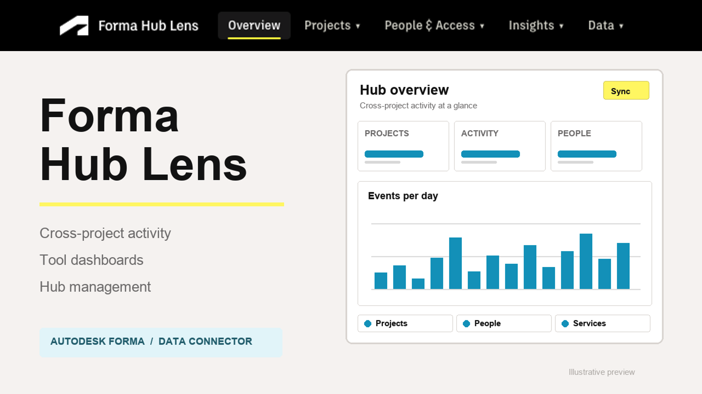

# Forma Hub Lens (Demo)

[](https://nodejs.org)
[](LICENSE)


A public, synthetic demonstration of Forma Hub Lens: one place to explore a Forma portfolio, investigate access and data, review closeout readiness, and practice controlled administrative workflows.

**Synthetic demo hub — all data and administrative actions are simulated. No Autodesk sign-in required.**

Anyone can open the demo directly. No Autodesk account, hub membership, Hub Admin role, Executive Overview role, or Forma subscription is required. The projects, people, companies, dashboards, jobs, integration findings, and closeout evidence are fictional. This deployment makes no APS API calls.



## Try the demo

Public deployment target: [forma-hub-lens.vercel.app](https://forma-hub-lens.vercel.app/). A repository update does not deploy the site by itself; the Vercel project must be connected and configured using the [deployment guide](docs/DEPLOYMENT.md).

1. Open the public demo; no sign-in is required.
2. Explore **Overview**, **Projects**, **People & Access**, **Insights**, **Data**, and **Admin**.
3. Open a project, person, or company to follow its fictional relationships.
4. Try **Admin → Bulk management**: configure, preview, confirm, and run a simulation.
5. Use **Reset simulation** to restore that view's initial state.

All 21 tool dashboards are populated from the bundled sample dataset. Administrative simulations stay in the current browser view; they send no invitations, create no Autodesk projects, change no memberships, and assign no subscriptions. Reporting uploads, live scans, Data Connector requests, package generation, and Autodesk downloads are unavailable.

Saved views, watchlist bookmarks, review decisions, and tool favorites use browser-local storage. They do not synchronize across devices or create scheduled monitoring. See [source and persistence limits](docs/LIMITATIONS.md).

## Run locally

Requires **Node.js 24.x** and npm. No APS application, credentials, callback registration, session secret, or environment file is required.

```bash
npm ci
npm run dev
```

Open [localhost:3000](http://localhost:3000). The sample data is loaded automatically; no extract upload or project sync is needed.

The optional settings in `.env.example` are `LENS_MODE=demo` (the default) and `LENS_LIVE_URL`, an external link to a separately hosted live application.

For a production build:

```bash
npm run build
npm start
```

## Separate from the live application

This repository is a demo-only derivative of [Forma Hub Lens](https://github.com/autodesk-platform-services/forma-hub-lens). It does not publish changes to that repository or alter its deployment. This build rejects live mode and does not use a real Forma hub ID. An optional **Live hub** header link opens a separately configured deployment; it does not change this app's authorization or dataset.

The live application requires Autodesk sign-in, retains its Hub Admin / Executive Overview checks, and requires Hub Admin for administrative changes. Opening the public demo grants no access to that separate application.

## Documentation

- [Usage and local setup](docs/USAGE.md)
- [Feature guide and source limits](docs/FEATURES.md)
- [Integration Health and Closeout workflows](docs/INTEGRATION-HEALTH-AND-CLOSEOUT.md)
- [Architecture and APS endpoints](docs/ARCHITECTURE.md)
- [Vercel deployment](docs/DEPLOYMENT.md)
- [Public demo boundaries](docs/PUBLIC-DEMO.md)
- [Known limitations](docs/LIMITATIONS.md)
- [Troubleshooting](docs/TROUBLESHOOTING.md)

## Development checks

```bash
npm run typecheck
npm test
npm run build
npm run test:smoke
```

Tests use synthetic fixtures and mocked responses; they require no APS credentials or Autodesk sign-in. After deployment, verify that the portfolio opens directly, the synthetic banner remains visible, and administrative actions are simulated.

## License and attribution

[MIT](LICENSE). Original sample copyright © 2026 Autodesk Platform Services. This separate demo is maintained under [rachermatt](https://github.com/rachermatt). Autodesk and Forma are trademarks of Autodesk, Inc. The illustrative preview is not a screenshot of a customer hub.
